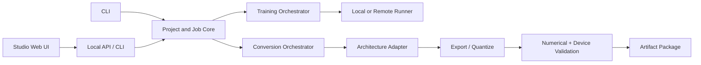

# Architecture

## System shape

LiteRT Studio is a local control plane around replaceable ML backends.

## Components

### Project core

A project owns immutable input references, versioned configuration, job
history, logs, metrics, and output manifests. Jobs have deterministic IDs
derived from normalized configuration and transition through `planned`,
`queued`, `running`, `succeeded`, `failed`, or `cancelled`.

### Training orchestrator

The orchestrator validates a dataset, selects a runner, constructs a
backend-specific command, captures environment metadata, checkpoints work, and
emits a model or adapter artifact. The first backend target is
Transformers + PEFT for LoRA/QLoRA.

### Conversion orchestrator

Conversion is not a single generic graph operation. An architecture adapter
maps source configuration, weights, tokenizer assets, cache layout, signatures,
and generation semantics to an exportable implementation. The pipeline then
exports, quantizes, compares outputs, and packages the result.

### Local API and web UI

The API is a thin boundary over the same application services used by the CLI.
The web client never reads arbitrary paths directly; the local service mediates
filesystem access and streams structured job events.

## Proposed package boundaries

| Package | Responsibility |
| --- | --- |
| `core` | IDs, job states, projects, manifests, errors |
| `conversion` | inspection, compatibility, adapters, export, verification |
| `training` | datasets, recipes, runners, checkpoints, metrics |
| `server` | HTTP/WebSocket transport and local access controls |
| `apps/studio-web` | workflow UI and artifact explorer |

## State and storage

Milestone 1 uses JSON files under a project-local `.litert-studio/` directory.
SQLite becomes the default when concurrent jobs and event streaming land.
Large assets remain external and are referenced by canonical path plus digest.

## Extension interfaces

- `ArchitectureAdapter`: supports/configures/maps/exports a model family.
- `TrainingBackend`: validates and launches a fine-tuning recipe.
- `Quantizer`: applies a named quantization policy.
- `Validator`: compares reference and exported behavior.
- `Runner`: executes a planned job locally or remotely.

Backends report capabilities rather than relying on UI hard-coding.
